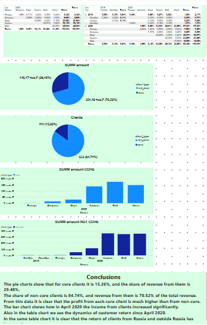

# 📈 Monthly Profit Analysis — Power BI Dashboard

This Power BI project provides a visual analysis of monthly profit data. It helps track business performance over time and identify trends in profitability.

## 📁 Files Included

- `monthly profit analysis.pbix` — Power BI file containing the dashboard and data model

## 📊 Dashboard Features

The dashboard includes:

- Monthly profit trends
- Total revenue and expenses breakdown
- Comparison between months
- KPIs such as total profit, average monthly profit, and profitability ratio
- Interactive filtering by month, product category, or region 

## 🎯 Project Goals

The main goal of this project is to demonstrate how Power BI can be used to:

- Monitor financial performance
- Present time-based trends
- Support decision-making with clear visuals

## 🧰 Tools Used

- Power BI Desktop
- Excel (or CSV) as a data source
- DAX for calculated metrics and measures

## 📷 Dashboard Preview

---

If you find this useful or have any questions, feel free to reach out or open an issue!
